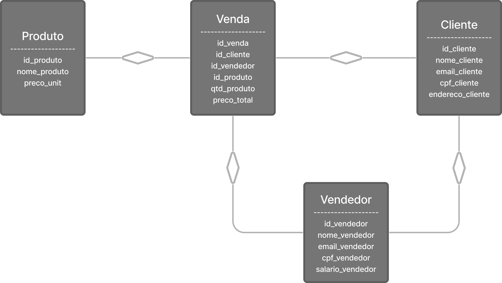

# Gerenciamento de Vendas - SimCity
O RH SimCity é um sistema de gerenciamento de recursos humanos que permite a gestão de vendedores, produtos, 
clientes e vendas. Ele oferece diferentes interfaces para vendedores e gerentes, permitindo que cada um acesse as 
funcionalidades relevantes.
## Funcionalidades
O sistema inclui as seguintes funcionalidades:

### Menu Principal
- Login como Vendedor
- Login como Gerente
- Sair
### Gerente
- Gerenciar vendedores ativos e não ativos
- Gerenciar Vendas
- Gerencial consultas:
  - Listar vendas acima de R$10.00
  - Deletar cliente (mantendo vendas relacionadas)
  - Listar vendas dos clientes excluídos
  - Clientes com e-mail 'zup.com.br'
  - Listar salário dos vendedores/gerentes

### Vendedor
- Gerenciar às vendas
- Gernciar os clientes
- Gerenciar o estoque:
  -  Adicionar produtos ao estoque
  - Listar estoque de produtos
  - Deletar produto
  - Editar produto
  - Voltar ao menu anterior

## Como Executar
Para executar  Gerenciamento de Vendas - SimCity, siga as instruções abaixo:
### Passos para Execução:
Para executar o sistema, siga estas etapas:

1. Clone o repositório para o seu ambiente local.
2. Configure o banco de dados PostgreSQL de acordo com as configurações no arquivo `application.properties`.
3. Abra o projeto em sua IDE preferida (como IntelliJ IDEA ou Eclipse).
4. Execute o aplicativo principal, que geralmente é encontrado em `src/main/kotlin/com/exemplo/Main.kt`.

## Linguagem de uso: **Kotlin**
Um trecho de código escrito em Kotlin:
~~~kotlin
val statement = connection.createStatement()
val resultSet = statement.executeQuery(sql)
while (resultSet.next()) {
    val salario = resultSet.getDouble("salario_vendedor")
    val nome = resultSet.getDouble("nome_vendedor")
    println("Nome do Vendedor: $nome | Salario: $salario")
}
~~~
### **Pessoa Autora**
Raissa Vicente Dias
* [GitHub](https://github.com/RaiVD)
* [Linkedin](https://www.linkedin.com/mwlite/in/raissa-vicente-86a3b2210)

## Modelo Relacional do Banco de dados
